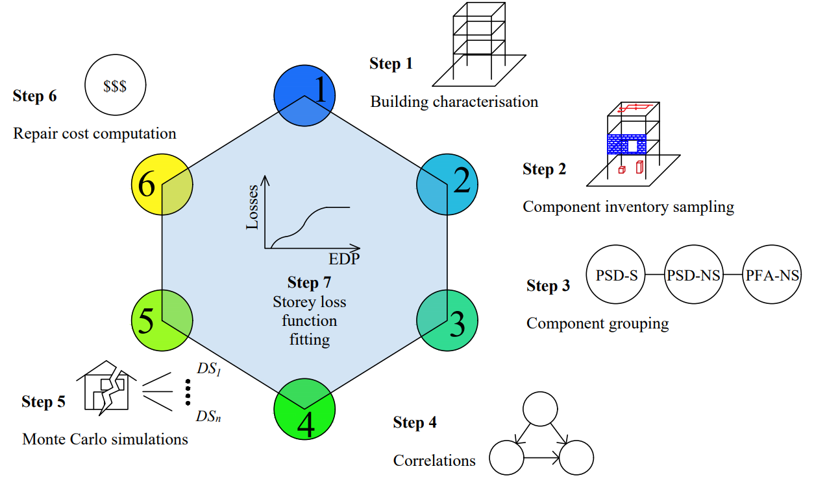
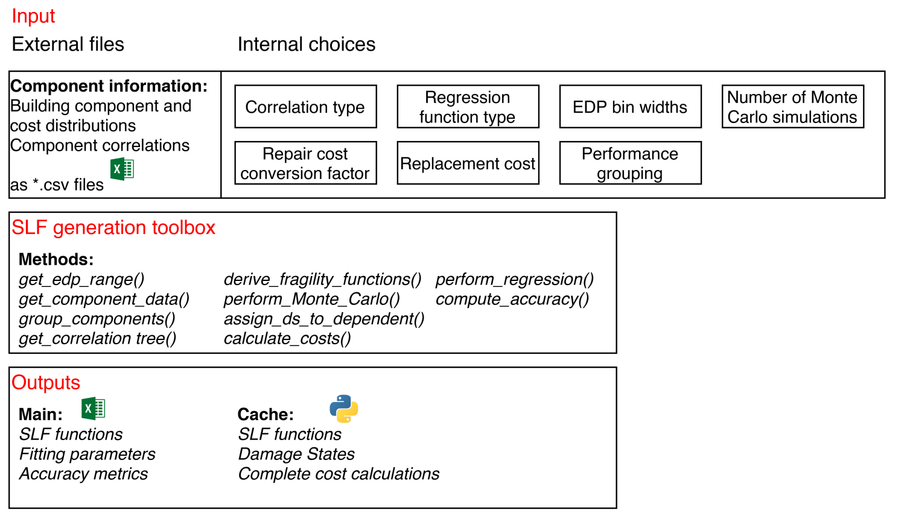
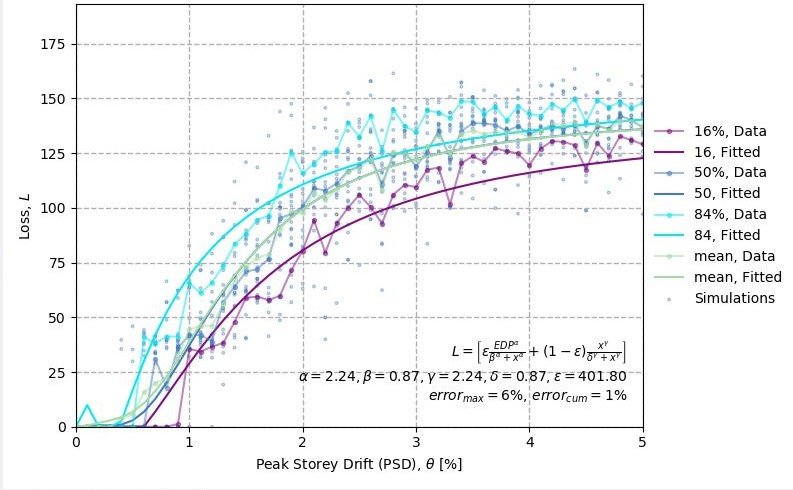

<h1 align="center">Storey-loss-function (SLF) Generator</h1> 

Performance-based earthquake engineering (PBEE) has become an important frame- work for quantifying seismic losses. 
However, due to its computationally expensive implementation through a typically detailed component-based approach (i.e. Federal Emergency Management Agency (FEMA) P-58), it has primarily been used within academic research and specific studies. 
A simplified alternative more desirable for practitioners is based on story loss functions (SLFs), which estimate a building’s expected monetary loss per story due to seismic demand. 

These simplified SLFs reduce the data required compared to a detailed study, which is especially true at a design stage, 
where detailed component information is likely yet to be defined. 
A Python-based toolbox for the development of user-specific and customizable SLFs for use within seismic design and assessment of buildings. 
Finally, a comparison of SLF-based and component-based loss estimation approaches is carried out through the application to a real case study school building. 
The tool was used within the reference publication, where the agreement and consistency of the attained loss metrics demonstrate the quality and ease of the SLF-based approach in achieving accurate results for a more expedite assessment of building performance.

The tool allows the automated production of SLFs based on input fragility, consequence and quantity data.

Considerations for double counting should be done at the input level and the consequence function should mirror it.

***
## Installation

    pip install storeyloss

***
## Example application without UI

    import storeyloss
    import pandas as pd

    component_data = pd.read_csv("sample/inventory.csv")
    correlation = pd.read_csv("sample/correlation.csv")

    model = storeyloss.SLF(
        component_data,
        'psd',
        correlation_tree=correlation,
        do_grouping=True,
    )

    out = model.generate_slfs()
    model.export_to_json(out, path)

## Example application with UI

    import storeyloss

    storeyloss.run()

### Table of Contents

Show/Hide

 

1. [Publications](#publications)
2. [Input arguments](#input-arguments)
3. [Workflow and Modules](#workflow)
4. [Tools Used](#tools-used)
5. [Acronyms](#acronyms)

### Publications

Show/Hide

 

[Shahnazaryan D, O’Reilly GJ, Monteiro R. Story loss functions for seismic design and assessment: Development of tools and application. 
Earthquake Spectra 2021. DOI: 10.1177/87552930211023523](https://www.researchgate.net/publication/353058466_Story_loss_functions_for_seismic_design_and_assessment_Development_of_tools_and_application)

### Input arguments

Show/Hide

 

* Project name
* .csv file containing component data
* .csv file containing the correlation tree, by default None
* Number of simulations, i.e. Monte Carlo simulations to generate damage states for analysis
* EDP name, i.e. PSD or PFA
* EDP bin, i.e. % for PSD and g for PFA
* Regression function type: weibull or papadopoulos
* Conversion factor for costs, by default 1.0
* Replacement cost of building, by default 1.0
* Flag to whether group components by their performance typology

### Workflow and Modules

Show/Hide

 

### Tools used

Show/Hide

 

* tkinter - Graphical User Interface
* pandas - manipulation of data
* numpy - computations
* matplotlib - for data visualization
  

* scipy optimization - fitting the data
* Monte Carlo simulations

### Acronyms

Show/Hide

 

EDP:    Engineering Demand Parameter

DV:     Decision Variable

DS:     Damage State

CDF:    Cumulative distribution function

